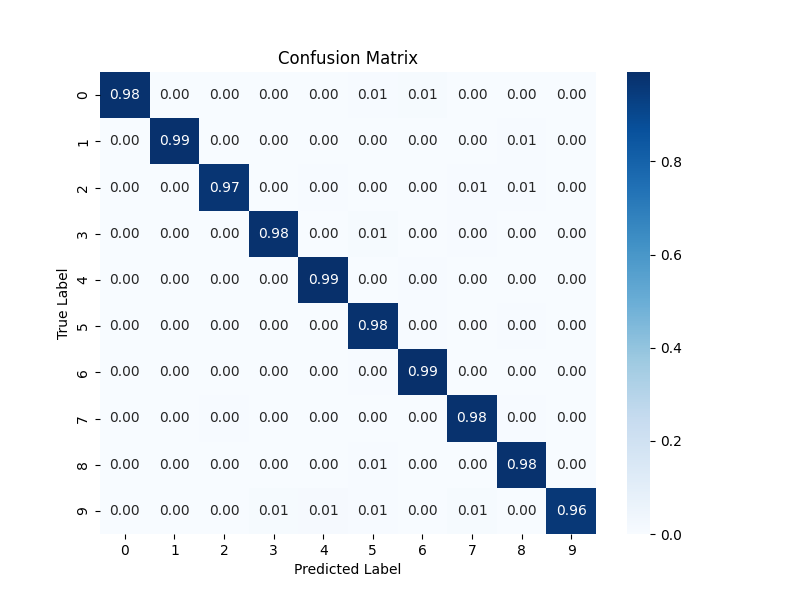

# MLP vs CNN for MNIST Classifier

## Overview

This project focuses on training and inference for image classification using the MNIST dataset. It provides functionality for training models (both Multi-Layer Perceptron - MLP and Convolutional Neural Network - CNN) and conducting inference on test data. The project is organized into separate modules for learning and inference, with utility functions and command-line interface (CLI) options for customization.

  
  
  <h3 align="center">
    Confusion matrix (MLP vs CNN)
  </h3>  

## Requirements

- Python 3.10 or later
- Click
- PyTorch